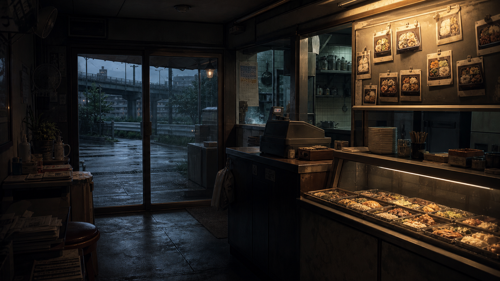

<div align="center">


# 嫌疑犯X的献身 · 互动推理

**一款基于东野圭吾《嫌疑犯X的献身》改编的分支推理视觉小说（Visual Novel）**

    

🚧 **制作中** — 全 7 章故事线已可从头玩到多结局；持续打磨美术与平衡。

</div>

---

## 简介

以东野圭吾经典推理小说《嫌疑犯X的献身》为蓝本的**沉浸式分支互动推理游戏**。
阅读剧情、在关键节点抉择，选择影响**状态变量**并在转折点分叉，最终走向多个结局；配 **路线图** 回溯重玩、**证物档案** 回顾线索、**描金暗玻璃 UI** 与 **BGM / 打字机音效** 营造电影感氛围。

> ⚠️ 本项目为出于学习与兴趣的**非商业同人 / 个人作品**。详见 [版权声明](#️-版权声明)。

## ✨ 核心特性

**叙事**
- 🎭 **分支叙事 · 4 结局** — 珠链式分支 + 状态变量在终章收束，导向真结局 / 好结局 / 2 个坏结局
- 📊 **状态变量** — `怀疑度 / 决意 / 信任 / 愧疚` 随选择浮动，决定结局走向
- 🔍 **证物 · 线索系统** — 共 **20** 条线索随调查解锁，部分选项需持有特定线索才出现
- 🗺️ **路线图回跳** — 已读节点可点击重玩，未解锁分支显示 `?`（人狼村式流程图）
- 👥 **角色档案 · 视角** — 7 名登场人物档案，随剧情解锁可用视角

**演出 · 界面**
- 🏛️ **描金暗玻璃主题** — 标题、对话框、右栏、快捷条、全部弹层统一的四角描金 + 衬线标题 + 红 `X` 视觉
- ⌨️ **打字机文本** — 逐字显示 + 采样打字音；点画面任意处推进，UI 区域点击不误推进
- 🎚️ **常驻快捷菜单** — `自动 / 快进 / 存档 / 读取`，自动·快进点亮显示当前开关状态
- 🎬 **暗调半写实美术** — 10 场景背景 + 10 关键事件 CG + 8 线索图标 + 封面，共 **29** 张

**系统**
- 💾 **存读档** — 3 槽位，带**场景缩略图 + 章节名 + 时间戳**；自动存档随进度更新
- ⚙️ **偏好持久化** — 文字速度 / 自动播放 + 速度 / 快进 / **BGM 与文字音效双音量** / 静音 / 音效开关，全部写入本地、跨会话保留
- 🎵 **音乐与音效** — 循环 BGM（元素池预热，切场景无延迟）+ 打字机音效
- 📜 **回想 (Backlog)** · 🏆 **结局画廊** · 📍 **已访问地点** · ↩️ **返回标题二次确认**
- 🧩 **数据驱动引擎** — 剧情即数据（JSON 节点图），引擎与内容彻底分离

## 🖼️ 画面预览

<div align="center">

**场景**

|  |  |  |
|:-:|:-:|:-:|
| 天亭便当店 · 清晨 | 靖子的公寓 · 夜 | 侦讯室 |

**事件 CG**

|  |  |  |
|:-:|:-:|:-:|
| 汤川夜访解题 | 雨夜撑伞 | 河边对峙 |

**线索图标**

       

</div>

## 🎮 操作说明

| 操作 | 行为 |
|---|---|
| **点击画面 / 空格 / 回车** | 推进对话（打字中则先显示整句） |
| **点击选项** | 在抉择点做出选择 |
| **快捷条 · 自动** | 开/关自动播放（速度可在设置调节） |
| **快捷条 · 快进** | 开/关快进（仅已读） |
| **快捷条 · 存档 / 读取** | 打开存读档槽位页 |
| **左栏 · 回想 / 地点 / 设置** | 打开回想录 / 已访问地点 / 设置 |
| **右栏 · 档案 / 人物** | 查看证物线索 / 角色档案；底部为路线图 |

## 🎵 音乐与音效

- **BGM** — 标题曲循环播放；进入对局后按章节情绪切换（元素池**预热**消除切曲延迟）。曲目清单见 [`assets/audio.json`](assets/audio.json)。
- **文字音效** — 采用采样打字音（优先），缺失时回退为合成噪声"嗒"声；音量、开关均可在设置调节。
- BGM 循环片段由 [`scripts/make-loop.mjs`](scripts/make-loop.mjs)（ffmpeg 尾→头交叉淡化）裁切而成。

## 📖 章节与结局

**章节（7 章 · 85 节点）**

1. 第一章 · 黄昏的访客　2. 第二章 · 河岸的发现　3. 第三章 · 旧友　4. 第四章 · 情敌
5. 第五章 · 罗网　6. 第六章 · 识破　7. 终章 · 献身

<details>
<summary><b>结局一览（点击展开 · 含剧透）</b></summary>

| 类型 | 结局 |
|---|---|
| 🏆 True | 真结局 · 嫌疑人的献身 |
| ✅ Good | 结局 · 无人识破 |
| ❌ Bad | 结局 · 东窗事发 |
| ❌ Bad | 结局 · 慌乱的代价 |

由终章依据 `怀疑度 / 决意` 等状态与关键旗标自动收束。

</details>

## 🚀 运行

无需安装任何依赖，本地起一个静态服务器即可：

```bash
# 推荐：项目自带的零依赖静态服务器（每个响应发 Cache-Control: no-store，
# 开发期改完普通刷新就是最新代码，避免 JS 模块被浏览器缓存导致的版本错配）
node scripts/serve.mjs 8099

# 然后浏览器访问 http://localhost:8099
```

> 不建议用 `python3 -m http.server`：它不发缓存控制头，改动后需 `Cmd+Shift+R` 硬刷新，否则容易出现新旧模块混用的报错。

校验剧情数据完整性（节点 / 资源 / 线索引用）与跑引擎单测：

```bash
node scripts/validate-story.mjs   # ✓ 全部引用有效
node tests/engine.test.mjs        # 引擎单测
```

## 📁 项目结构

```
index.html · main.js          入口与装配（启动 / 配置加载 / 组件接线）
engine/
  state.js                    状态机 + 存读档 + 跨周目进度
  director.js                 节点导演（场景 → 台词 → 分支/结局 → 跳转）
  story.js · conditions.js    章节加载 · 条件求值（旗标/线索/变量/与或非）
  assets.js                   图片清单加载
  audio.js · sfx.js           BGM 播放器（元素池预热/多音量）· 打字音效
  config.js                   偏好持久化（localStorage）
ui/
  scene.js dialogue.js status.js    场景 · 对话框(打字机) · 状态条
  panel.js clues.js flowchart.js    右栏(档案·人物) · 证物 · 路线图
  navrail.js quickbar.js menus.js   左导航 · 快捷条 · 弹层菜单
  dom.js                            DOM 小工具
data/
  chapters/chNN.json          剧情节点图（7 章 · 85 节点）
  clues.json characters.json endings.json
styles/  global.css scene.css ui.css     描金暗玻璃主题
assets/
  manifest.json               图片清单（id → 路径）
  images/                     29 张美术（场景/CG）+ cover_icons/（封面 + 8 线索图标）
  audio/  audio.json          BGM + 文字音效
  prompts.(json|md)           各图生成提示词
scripts/
  serve.mjs                   零依赖 no-store 静态服务器
  sync-manifest.mjs           出图后回填 manifest
  validate-story.mjs          校验节点/资源/线索引用
  make-loop.mjs               ffmpeg 无缝循环裁切（BGM）
tests/   engine.test.mjs       引擎单测（node 直接运行）
```

## 🧩 引擎数据模型（简）

剧情是一张 **节点图**：每个节点含 `bg / cg / pov / lines[]` 与出口（`next` / `choices[]` / `branches[]` / `ending` / `chapterEnd`）。

```jsonc
"ch01_003": {
  "bg": "bg_tentei_day",
  "lines": [{ "speaker": "石神", "text": "……招牌便当，一个。" }],
  "onEnter": { "clues": ["green_bicycle"], "state": { "trust": 1 } },
  "choices": [
    { "text": "多看她一眼", "tag": "分支", "effects": { "state": { "guilt": 1 } }, "goto": "ch01_004" },
    { "text": "低头离开", "goto": "ch01_005" }
  ]
}
```

- **条件**（`requires`）支持 `flags / notFlags / clues / vars(gte,lte…) / any / all / not`，用于隐藏选项或在终章按状态收束分支。
- **状态机**记录变量、旗标、线索、视角、已访问节点/地点、已解锁结局；存档与跨周目进度走 localStorage（私密模式自动退回内存）。

## 🎨 美术 / 音频流水线

共 29 张图，统一为**暗调半写实动漫 VN 风**。

1. 提示词见 [`assets/prompts.md`](assets/prompts.md) / [`assets/prompts.json`](assets/prompts.json)（每张含类型与尺寸约定）
2. 出图后按文件名存入 `assets/images/`（封面与线索图标放 `cover_icons/`）
3. 运行 `node scripts/sync-manifest.mjs` 回填 `manifest.json`，刷新浏览器即生效

## 🗺️ 开发进度

- [x] **P0** — 数据驱动引擎 + 核心 UI + 美术接入 + 引擎单测
- [x] **P1** — 全 7 章 85 节点剧情 · 路线图回跳 · 证物/线索系统 · 角色档案
- [x] **P2** — 终章多结局收束 · 结局画廊 · 描金暗玻璃 UI · BGM/打字音效 · 持久化设置 · 缩略图存档
- [ ] **打磨** — 美术微调 · 数值平衡 · 更多视角片段 · 移动端适配

## 🛠 技术栈

原生 **HTML / CSS / JavaScript（ES Modules）**。无构建步骤、无框架、零运行时依赖。

## ⚖️ 版权声明

- 原著《嫌疑犯X的献身》版权归 **东野圭吾** 及其出版方所有；本项目为**非商业**的同人 / 学习作品。
- 本仓库**不包含**原著文本，剧情为**改编转写**而非原文照搬。
- 美术资产由 AI 依据本项目提示词生成，仅用于本项目演示。
- 如涉及侵权，请联系删除。

---

<sub>🚧 制作中 · 部分内容借助 Claude Code 协作完成。</sub>
